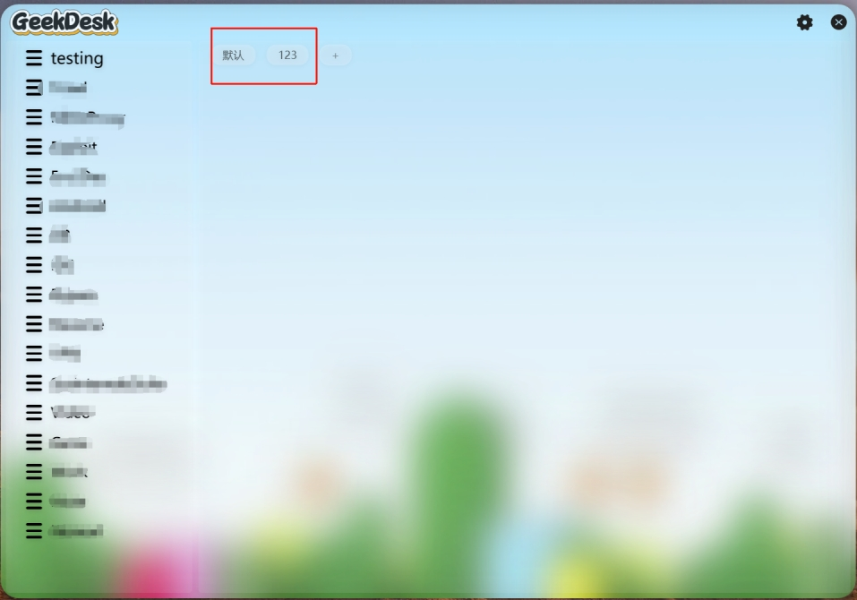

# GeekDesk (Fork v2.6.0)

> ## ⚠️ Fork Notice
> This repository is a fork of [BookerLiu/GeekDesk](https://github.com/BookerLiu/GeekDesk), licensed under the original [Apache License 2.0](LICENSE).
> - **Changes in this fork**: added "second-level sub-groups" — each first-level menu can contain multiple groups, switched via a chip row on top of the right icon card; icons can be moved into/out of groups by dragging onto chips or via the icon context menu; grouped icons are included in global search; deleting a group returns its icons to the default list. Data files remain fully compatible with v2.5.15.
> - **Build change**: .lnk shortcut parsing now uses dynamic `WScript.Shell` COM invocation instead of the generated COM interop assembly; behavior is identical.
> - **About the bundled Everything**: the bundled [Everything](https://www.voidtools.com/) search engine (Everything.exe / SDK DLLs) is copyrighted by voidtools and subject to its own license terms; it is integrated the same way as the original project.
> - All credit for the original project belongs to [BookerLiu](https://github.com/BookerLiu) — please support the upstream project. Please file issues for this fork in this repository.
> - Back up your `Data` file before upgrading.

---

# GeekDesk 极客桌面（原项目 / Original project）
Small, **beautiful** desktop quickstart management tool with integrated Everything search
- [中文介绍](README-zh.md)
- [English-machine translation](README.md)
  

Free / beautiful / highly customized is the need and direction since the birth of GeekDesk, and will develop in these directions in the future

you can raise issues if you have good suggestions

In addition, if you like GeekDesk, you may be able to buy anti-exfoliation shampoo for the author
Of course, ordering a Star is also an incentive for the author~ 😊😊😊  

[**Paypal**](https://www.paypal.com/paypalme/BookerLiu) 

### Other:

### GitHub
[https://github.com/BookerLiu/GeekDesk](https://github.com/BookerLiu/GeekDesk)  
### Gitee
[https://gitee.com/BookerLiu/GeekDesk](https://gitee.com/BookerLiu/GeekDesk)

## Integrate Everything to quickly search the entire disk
- Integrate Everything to quickly search the entire disk  
  

## Global hotkeys / one-click callout / mouse follow
- Customize hotkeys settings and use the shortcuts you are used to
- One-click outbound call Use the middle mouse button to call out
- Mouse Follow Automatically follows the mouse position

## Custom wallpaper
- Feel free to choose your favorite wallpaper  

## Interface effects such as frosted glass
- Background image frosted glass effect
- Interface transparency
- Interface rounded corners  

## Customize the menu icon
- More than 80 system icons to choose from
- It also supports online import of Alibaba icon icons  
- For space reasons, reply in the public account Custom icon You can view the tutorial Now the tutorial link has been pasted in the software Welcome to pay attention to my public account😊

## Scheduled reminders Never forget
- Scheduled reminders Never forget

## Development framework
- wpf
- .net 4.7.2
- [HandyControl](https://github.com/HandyOrg/HandyControl)  

## Contributors

